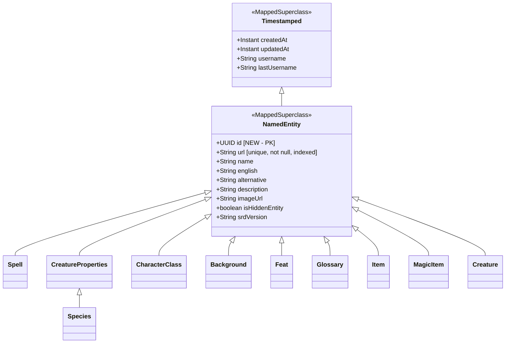

# Миграция с URL как ID на UUID

## Текущее состояние

Все основные доменные сущности наследуют [`NamedEntity`](src/main/java/club/ttg/dnd5/domain/common/model/NamedEntity.java:14), где поле `url` (String) является `@Id`:

```java
@Id
@Column(nullable = false, unique = true)
private String url;
```

### Затронутые сущности (11 штук)

| Сущность | Таблица | Файл |
|----------|---------|------|
| Spell | spell | domain/spell/model/Spell.java |
| Species | species | domain/species/model/Species.java |
| CharacterClass | class | domain/character_class/model/CharacterClass.java |
| Creature | bestiary | domain/beastiary/model/Creature.java |
| Background | background | domain/background/model/Background.java |
| Feat | feat | domain/feat/model/Feat.java |
| Glossary | glossary | domain/glossary/model/Glossary.java |
| Item | item | domain/item/model/Item.java |
| MagicItem | magic_item | domain/magic/model/MagicItem.java |
| Source | source | domain/source/model/Source.java (PK = acronym, url — обычное поле) |
| CreatureProperties | — | MappedSuperclass для Species |

### Проблема

Когда URL сущности меняется, приходится удалять старую запись и создавать новую, потому что URL является первичным ключом. Это ломает связи (FK), историю, аудит.

### Связи через URL (FK)

- `Species.parent_url` → `Species.url`
- `CharacterClass.parent_url` → `CharacterClass.url`
- ManyToMany join-таблицы для Spell: `spell_species_affiliation`, `spell_lineages_affiliation`, `spell_class_affiliation`, `spell_subclass_affiliation`, `spell_feat_affiliation`
- `full_name_search_view` — SQL view, использует `url` как ID

---

## Целевая архитектура

### Принцип

- **UUID** — стабильный внутренний идентификатор (PK в БД)
- **URL** — мутабельное поле для SEO/роутинга на фронтенде (unique, not null, indexed)

### API контракт (рекомендация)

| Операция | Путь | Идентификатор |
|----------|------|---------------|
| GET (фронтенд, чтение) | `/api/v2/spells/{url}` | URL — для SEO и роутинга |
| GET (форма редактирования) | `/api/v2/spells/{url}/raw` | URL |
| POST (создание) | `/api/v2/spells` | Возвращает UUID |
| PUT (обновление) | `/api/v2/spells/{id}` | UUID — позволяет менять URL |
| DELETE | `/api/v2/spells/{id}` | UUID |
| HEAD (проверка) | `/api/v2/spells/{url}` | URL |

В ответах всегда возвращать и `id` (UUID), и `url`. Фронтенд использует URL для навигации, а UUID — для операций записи.

---

## Архитектурная диаграмма



---

## План миграции по шагам

### Фаза 1: Liquibase миграция БД

Для каждой таблицы, наследующей NamedEntity:

1. Добавить колонку `id UUID` с дефолтом `gen_random_uuid()`
2. Заполнить UUID для всех существующих записей
3. Удалить старый PK constraint на `url`
4. Установить `id` как новый PK
5. Добавить UNIQUE constraint + INDEX на `url`
6. Обновить FK в join-таблицах: заменить ссылки на `url` ссылками на `id`
7. Обновить `full_name_search_view`

**Порядок таблиц** (с учётом зависимостей):
1. `species` (имеет self-reference `parent_url`)
2. `class` (имеет self-reference `parent_url`)
3. `spell` (зависит от species, class, feat через ManyToMany)
4. `feat`
5. `background`
6. `bestiary`
7. `glossary`
8. `item`
9. `magic_item`

### Фаза 2: Изменение NamedEntity

Изменить [`NamedEntity`](src/main/java/club/ttg/dnd5/domain/common/model/NamedEntity.java):

```java
@Id
@UuidGenerator
private UUID id;

@Column(nullable = false, unique = true)
private String url;
```

Убрать `implements Persistable<String>`, заменить на `Persistable<UUID>` или убрать совсем (JPA сам определит новизну по `id == null`).

### Фаза 3: Обновление моделей

- `Species`: `@JoinColumn(name = "parent_id")` вместо `parent_url`
- `CharacterClass`: аналогично
- Все `@ManyToMany` join-таблицы: JPA автоматически использует новый PK

### Фаза 4: Обновление репозиториев

- Изменить `JpaRepository<Entity, String>` → `JpaRepository<Entity, UUID>`
- Добавить методы `findByUrl(String url)` где их нет
- Обновить кастомные `@Query` если они ссылаются на `url` как ID

### Фаза 5: Обновление сервисов

- Методы чтения: продолжают искать по URL (для фронтенда)
- Методы записи (update, delete): переходят на UUID
- Метод create: возвращает UUID вместо URL

### Фаза 6: Обновление контроллеров

- GET эндпоинты: оставить `{url}` path variable
- PUT/DELETE: изменить на `{id}` (UUID)
- POST: возвращать UUID
- Все response DTO: добавить поле `id` (UUID)

### Фаза 7: Обновление DTO и маппинга

- Добавить `UUID id` во все response DTO
- Обновить MapStruct маппинги
- Обновить `FullTextSearchView` модель

### Фаза 8: Тесты

- Обновить существующие тесты
- Добавить тесты на обновление URL без потери сущности

---

## Риски и митигация

| Риск | Митигация |
|------|-----------|
| Потеря данных при миграции FK | Миграция в транзакции, backup перед деплоем |
| ManyToMany join-таблицы ссылаются на url | Liquibase: создать новые FK колонки, мигрировать данные, удалить старые |
| full_name_search_view сломается | Пересоздать view в той же миграции |
| Фронтенд сломается | GET по URL остаётся, в ответах добавляется UUID |
| Кэш (Caffeine) может использовать url как ключ | Проверить CacheConfig и обновить при необходимости |

---

## Затронутые файлы (оценка)

- **Модели**: ~10 файлов
- **Репозитории**: ~10 файлов
- **Сервисы**: ~15 файлов
- **Контроллеры**: ~10 файлов
- **DTO/Mappers**: ~20 файлов
- **Liquibase миграции**: 1-3 файла
- **SQL view**: 1 файл
- **Тесты**: ~5-10 файлов
- **Итого**: ~70-80 файлов
